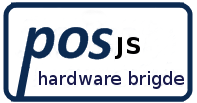
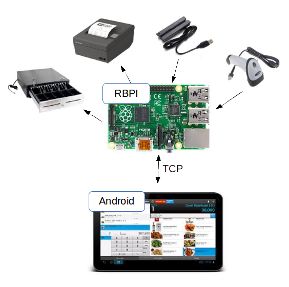

Posjs is a web based POS (Point of Sale) container and hardware bridge. 
In this version we use Apache Cordova platform to allow building of native 
mobile applications using HTML, CSS and JavaScript. 

We use a tcp socket cordova plugin to extend javascript environment with objects. 
That objects are used to access hardware-specific features like printing and 
scan text codes with HID USB devices.



The above figure shows a possible deploy of the system. Firstly a raspberry pi 
connected with compatible devices (printer EPSON TM-T20II, 
barcode scanner MJ_tech V3.00, magnetic card reader model MSR100 and Epson 
compatible cash drawers). In this node we execute The Server, that implement 
a TCP slave and contain drivers to allow communications with compatible devices.
On the other hand we need a tablet with Android. We provide a Apache Cordova 
based SDK that allow building mobile applications using web development technologies.

See [LICENSE](LICENSE).

## Building

### Requirements

* Linux based OS with 64-bit or 32-bit architecture. 
* C++ toolchain.
* libusb-0.1-4.
* Android Studio 1.0.2 or newer.
* [Git](http://git-scm.com/).
* [Qt5.3.0](http://qt-project.org/downloads).

### Server

1. Open your command prompt and download the latest [posjs2](https://github.com/Zimtronic/posjs2).

 ```sh
  git clone https://github.com/Zimtronic/posjs2.git
  cd posjs2/Server
  ```
  
2. Execute `qmake` to create Makefile. 
3. Execute `make` to compile.
4. Execute `sudo ./server` to run the Server. Don't forget to prefix with `sudo`. 

### Android SDK

1. Execute Android Studio IDE
2. Use Open option in the File menu (File->Open) and locate the Android 
   directory into de posjs2 root directory.
3. Use an usb data cable and connect a tablet with Android to the PC.
4. Send the android app to your table, use the Run option (Shift+F10). 
